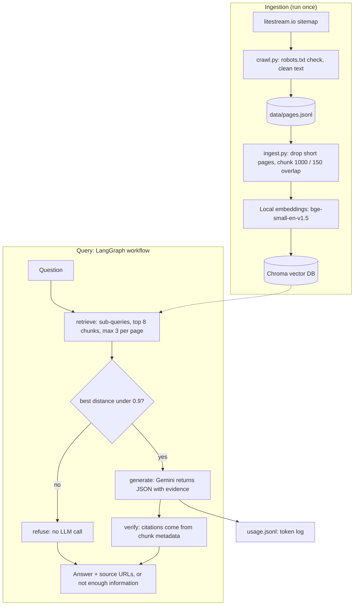

# Website-Grounded RAG Agent (Litestream docs)

An agent that answers questions using **only** the content of a public website, cites the source URLs, and says so when the site doesn't contain the answer. It tracks token usage and estimated cost.

- **Website:** the Litestream documentation (https://litestream.io), latest version only (62 useful pages after filtering)
- **Stack:** Python, LangGraph + LangChain, Chroma (local vector DB), local embeddings (`BAAI/bge-small-en-v1.5`), Gemini (`gemini-3.5-flash-lite`, free tier)
- **Result:** 14/15 on my 15-question evaluation set (details and the one failure below)

## Architecture



The diagram is also saved as `docs/architecture.png`.

## Setup

Tested on Python 3.11.

```bash
git clone https://github.com/halasri-dev/website-rag-agent.git
cd website-rag-agent
python -m venv .venv
# Windows: .venv\Scripts\Activate.ps1      Mac/Linux: source .venv/bin/activate
pip install -r requirements.txt
```

Create a free API key at https://aistudio.google.com, then copy `.env.example` to `.env` and fill it in:

```
GOOGLE_API_KEY=your-key
GEMINI_MODEL=gemini-3.5-flash-lite
```

## Run it

```bash
python src/crawl.py                         # optional: re-crawl (the crawled pages are already in data/pages.jsonl)
python src/ingest.py                        # chunk, embed locally, build the Chroma DB (about 1-2 minutes)
python src/cli.py "How do I restore a database from S3?"   # ask one question
python src/cli.py                           # interactive mode
python src/cli.py --usage                   # token totals from logs/usage.jsonl
python eval/run_eval.py                     # run the 15-question evaluation
python src/cost.py                          # regenerate docs/cost_analysis.md from the evaluation results
```

## How it works

1. **Crawl** (`crawl.py`): reads the site's sitemap to find every documentation page, respects `robots.txt`, skips the old v0.3 docs, waits 1 s between requests, strips navigation and anchor links, and keeps sentences whole.
2. **Ingest** (`ingest.py`): drops pages under 100 words, splits into 1000-character chunks (150 overlap), prefixes each chunk with its page title, and stores `url`, `title` and `chunk_id` as metadata. 62 pages became 597 chunks (141,810 embedding tokens).
3. **Retrieve** (`graph.py`): fetches 20 candidates, sends the best 8 to the LLM with at most 3 per page, and searches each half of "A and B" questions separately.
4. **Route:** if even the closest chunk is far from the question (distance above 0.9), the question is off-topic and is refused **without calling the LLM** (0 tokens).
5. **Generate:** Gemini must return JSON with an exact `evidence` quote from the passages, an `enough_info` flag and the answer. No evidence means a refusal.
6. **Cite:** URLs come from the metadata of the chunks that contain the model's evidence (plus the passages it reported), never from text the model typed.

## Key decisions

| Decision | Why |
|---|---|
| Litestream docs | Static HTML, 60+ substantive pages, specific facts that make good tricky questions, and niche enough that the LLM can't answer from memory |
| Latest docs only | The site keeps v0.3 next to the current version; mixing them would create contradictory answers |
| Local embeddings | Free, no rate limits, reproducible; ingestion costs $0 |
| Distance check before the LLM | Off-topic questions cost nothing (relevant chunks scored about 0.40-0.49, off-topic about 1.1) |
| Evidence quote required | A passing mention ("unlike MySQL") is not an answer; forcing a quote reduces false support |
| `gemini-3.5-flash-lite` | Its free tier (500 requests/day, 15/minute) is enough to run and demo the project reliably |

## Evaluation

15 questions in `eval/questions.json`: 3 straightforward, 3 paraphrased, 3 multi-page, 3 misleading (the question contains a false claim), 3 unanswerable. Answerable questions are checked on answer keywords and the source URL; unanswerable ones must be refused; misleading ones must be refused or corrected.

**Final result: 14/15** (raw output in `eval/results_gemini-3.5-flash-lite.json`)

| Type | Passed |
|---|---|
| Straightforward | 3/3 |
| Paraphrased | 3/3 |
| Multi-page | 3/3 |
| Misleading | 3/3 |
| Unanswerable | 2/3 |

### How the evaluation shaped the pipeline

Two choices came from manual testing before the first full run: a distance check that refuses clearly off-topic questions before any LLM call, and a required evidence quote, because early tests showed the model treating a passing comparison as an answer.

The first full evaluation scored **10/15** (straightforward 2/3, paraphrased 3/3, multi-page 0/3, misleading 3/3, unanswerable 2/3). What I changed, and why:

| Failure found | Change |
|---|---|
| Q3: the correct page was crowded out of the top 5 results | Fetch 20 candidates, send 8 to the LLM, at most 3 per page |
| Q7-Q9: multi-page questions were refused or answered only in part | Prompt now allows partial answers, and each half of an "A and B" question is searched separately |
| Q11: a false premise was only refused | Prompt now corrects the false claim, then answers the supported part |
| Citations pointed to the wrong page or dropped pages | Cite the union of the passages the model reported and the passages verified to contain its evidence quote |

Result: **14/15**.

### Known limitations

- **Q14 fails:** for "Does Litestream support MySQL?" the model says the passages only mention MySQL as a comparison, but it sets `enough_info` to true and cites a page instead of refusing. The small model still treats passing mentions as partial support.
- **Citations are per answer, not per claim.** In Q7 the source list includes `guides/directory/`, which is about directory replication, not a list of providers.
- **Non-deterministic:** this model ignores the temperature setting, so different runs can differ by a question.
- **Small, tuned evaluation set:** the fixes above were made while looking at these 15 questions, so the score is optimistic. A held-out set would be more honest.
- **`gemini-3.8-flash`:** in a single manual test it refused the MySQL question correctly, and it answered the first 5 evaluation questions correctly, but the free tier allows only 20 requests per day, so I did not complete a full run. Switching is a one-line change to `GEMINI_MODEL`.
- **The crawl is a snapshot** of the current docs and is not refreshed automatically.

## Cost

Token counts are measured from the API's usage metadata; prices are the paid rates for Gemini 3.5 Flash-Lite ($0.30 per 1M input and $2.50 per 1M output tokens). Development ran on the free tier, so actual spend was $0.

- **Ingestion:** $0 (local embeddings, no LLM calls). For comparison, embedding the same 141,810 tokens with a hosted model (gemini-embedding-001 at $0.15 per 1M tokens) would cost about $0.02.
- **Average answered query:** about 2,383 input + 78 output tokens, about **$0.0009**
- **100 / 1,000 / 10,000 queries:** about **$0.09 / $0.91 / $9.11**
- Off-topic questions are refused before the LLM and cost $0

Details and a worked example are in `docs/cost_analysis.md`.

## What I would improve

- Add a reranker and hybrid keyword + vector search
- A second verification pass on the answer, using a stronger model only for that step
- Per-claim citations instead of per-answer citations
- A held-out evaluation set and multiple runs per model
- Scheduled re-crawling and caching of repeated questions

## Project layout

```
src/        crawl.py, ingest.py, graph.py (LangGraph workflow), cli.py, usage.py, cost.py
eval/       questions.json, run_eval.py, results_gemini-3.5-flash-lite.json
data/       pages.jsonl (crawled pages)
docs/       architecture.png / .md, cost_analysis.md
```

*Built with AI-assisted coding (Claude); I reviewed the design decisions above and can walk through them.*