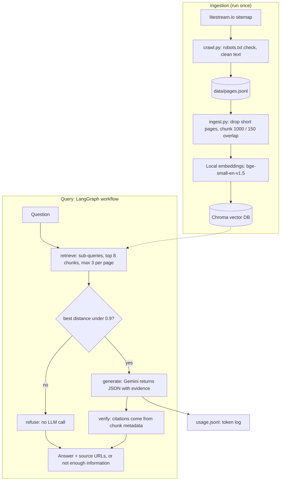

# Architecture

## Components

| Component | File | Role |
|---|---|---|
| Crawler | `src/crawl.py` | Reads the sitemap, checks `robots.txt`, extracts clean text |
| Ingestion | `src/ingest.py` | Filters short pages, chunks, embeds locally, stores in Chroma |
| Workflow | `src/graph.py` | LangGraph: retrieve, route, generate or refuse |
| CLI | `src/cli.py` | Ask questions, show token totals |
| Usage log | `src/usage.py` | One JSON line per ingestion run or model call |
| Cost | `src/cost.py` | Turns measured tokens into cost estimates |

The same diagram is saved as an image in `docs/architecture.png`.